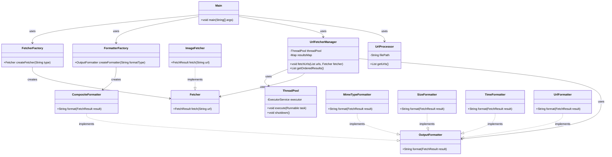

```mermaid
classDiagram
    class Main {
        +void main(String[] args)
    }
    class UrlProcessor {
        -String filePath
        +List getUrls()
    }
    class ThreadPool {
        -ExecutorService executor
        +void execute(Runnable task)
        +void shutdown()
    }
    class UrlFetcherManager {
        -ThreadPool threadPool
        -Map resultsMap
        +void fetchUrls(List urls, Fetcher fetcher)
        +List getOrderedResults()
    }
    class Fetcher {
        +FetchResult fetch(String url)
    }
    class ImageFetcher {
        +FetchResult fetch(String url)
    }
    class FetcherFactory {
        +Fetcher createFetcher(String type)
    }
    class OutputFormatter {
        +String format(FetchResult result)
    }
    class CompositeFormatter {
        +String format(FetchResult result)
    }
    class MimeTypeFormatter {
        +String format(FetchResult result)
    }
    class SizeFormatter {
        +String format(FetchResult result)
    }
    class TimeFormatter {
        +String format(FetchResult result)
    }
    class UrlFormatter {
        +String format(FetchResult result)
    }
    class FormatterFactory {
        +OutputFormatter createFormatter(String formatType)
    }

    ImageFetcher ..|> Fetcher : implements
    FetcherFactory --> Fetcher : creates
    CompositeFormatter ..|> OutputFormatter : implements
    MimeTypeFormatter ..|> OutputFormatter : implements
    SizeFormatter ..|> OutputFormatter : implements
    TimeFormatter ..|> OutputFormatter : implements
    UrlFormatter ..|> OutputFormatter : implements
    FormatterFactory --> CompositeFormatter : creates
    Main --> FetcherFactory : uses
    Main --> FormatterFactory : uses
    Main --> UrlFetcherManager : uses
    Main --> UrlProcessor : uses
    UrlFetcherManager --> ThreadPool : uses
    UrlFetcherManager --> Fetcher : uses
    UrlFetcherManager --> OutputFormatter : uses


```