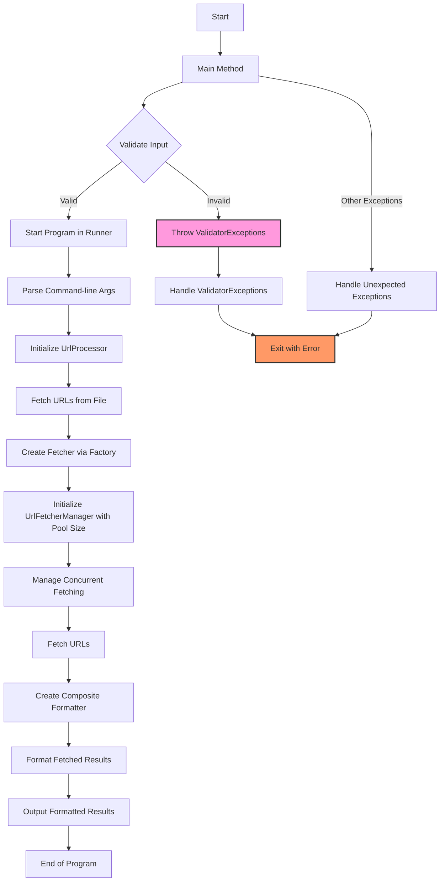

```mermaid
flowchart TD
    A[Start] --> B[Main Method]
    B --> C{Validate Input}
    C -->|Valid| D[Start Program in Runner]
    C -->|Invalid| E[Throw ValidatorExceptions]
    E --> F[Handle ValidatorExceptions]
    F --> G[Exit with Error]
    D --> H[Parse Command-line Args]
    H --> I[Initialize UrlProcessor]
    I --> J[Fetch URLs from File]
    J --> K[Create Fetcher via Factory]
    K --> L[Initialize UrlFetcherManager with Pool Size]
    L --> M[Manage Concurrent Fetching]
    M --> N[Fetch URLs]
    N --> O[Create Composite Formatter]
    O --> P[Format Fetched Results]
    P --> Q[Output Formatted Results]
    Q --> R[End of Program]
    B -->|Other Exceptions| S[Handle Unexpected Exceptions]
    S --> G
    style G fill:#f96,stroke:#333,stroke-width:2px
    style E fill:#f9d,stroke:#333,stroke-width:2px
```